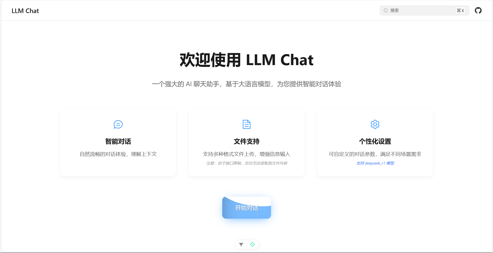

# StellarChat

StellarChat 是一个基于大型语言模型（LLM）的现代化实时聊天应用，结合了 Vue 3 前端和 FastAPI 后端，提供流畅、智能的对话体验。它支持流式响应、多模型切换、会话管理、Markdown 渲染等功能，旨在为用户提供高质量的 AI 对话服务。



## 目录

- [核心特性](#核心特性)
- [技术架构](#技术架构)
- [功能详解](#功能详解)
- [快速开始](#快速开始)
- [API 接口](#api-接口)
- [部署指南](#部署指南)
- [项目结构](#项目结构)
- [贡献指南](#贡献指南)
- [许可证](#许可证)

## 核心特性

- **实时对话**: 支持 WebSocket 实时聊天，提供低延迟的交互体验
- **流式响应**: 消息逐字输出，模拟真实的打字效果
- **多模型支持**: 支持多种 LLM 模型，包括 DeepSeek、Qwen、GLM 等系列
- **会话管理**: 支持创建、编辑、删除和切换对话历史
- **Markdown 渲染**: 支持代码高亮、表格、列表等 Markdown 语法
- **深度思考展示**: 可视化展示模型的推理过程
- **文件上传**: 支持图片文件上传和预览
- **主题切换**: 支持明亮和暗黑模式
- **响应式设计**: 适配桌面端和移动端设备
- **API 兼容**: 兼容 OpenAI API 格式，便于集成

## 技术架构

StellarChat 采用前后端分离的架构设计：

```
┌─────────────────┐    HTTP/WebSocket    ┌─────────────────┐
│   前端 (Vue 3)   │◄────────────────────►│   后端 (FastAPI) │
└─────────────────┘                      └─────────────────┘
                                                     │
                                                     ▼
                                            ┌─────────────────┐
                                            │   LLM 模型服务   │
                                            └─────────────────┘
```

### 前端技术栈

- **框架**: Vue 3 (Composition API) + JavaScript
- **构建工具**: Vite
- **样式**: SCSS + CSS 变量
- **UI 组件库**: Element Plus
- **状态管理**: Pinia (支持持久化)
- **路由**: Vue Router
- **HTTP 客户端**: Fetch API
- **Markdown 渲染**: markdown-it + highlight.js

### 后端技术栈

- **框架**: FastAPI (Python 3.8+)
- **数据库**: SQLite (通过 SQLAlchemy ORM)
- **模型推理**: Transformers (Hugging Face) + PyTorch
- **监控**: Prometheus
- **日志**: Python logging
- **测试**: pytest

## 功能详解

### 1. 聊天界面

- **消息展示**: 区分用户消息和 AI 回复，支持 Markdown 渲染和代码高亮
- **消息操作**: 支持复制、重新生成、点赞、点踩等操作
- **深度思考**: 可视化展示模型的推理过程，支持折叠/展开
- **文件预览**: 支持图片文件上传和预览展示
- **Tokens 信息**: 显示生成的 tokens 数量和生成速度

### 2. 输入区域

- **文本输入**: 支持多行文本输入和自动调整高度
- **快捷键**: Enter 发送消息，Shift+Enter 换行
- **文件上传**: 支持拖拽上传图片文件，支持图片预览

### 3. 会话管理

- **对话列表**: 侧边栏展示对话历史，支持搜索和切换
- **对话操作**: 支持新建、重命名、删除对话
- **持久化存储**: 对话历史本地持久化存储

### 4. 设置面板

- **模型选择**: 支持多种 LLM 模型切换
- **参数设置**: 可调节 temperature、max_tokens 等参数
- **主题切换**: 支持明亮和暗黑模式
- **流式输出**: 可开关流式响应功能

## 快速开始

### 环境要求

- **前端**: Node.js 16+、pnpm 8+
- **后端**: Python 3.8+、pip
- **模型**: 根据需要下载相应的 LLM 模型文件

### 安装步骤

1. **克隆项目**:
   ```bash
   git clone https://github.com/HxCodeWarrior/StellarChat.git
   cd StellarChat
   ```

2. **安装前端依赖**:
   ```bash
   cd frontend
   pnpm install
   ```

3. **安装后端依赖**:
   ```bash
   cd backend
   pip install -r requirements.txt
   ```

4. **下载模型**:
   ```bash
   python download_model.py
   ```

### 运行应用

1. **启动后端服务**:
   ```bash
   cd backend
   python app/main.py
   ```

2. **启动前端服务**:
   ```bash
   cd frontend
   pnpm dev
   ```

3. **访问应用**: 
   -  前端: `http://localhost:5173`
   -  后端 API 文档: `http://localhost:8080/api/docs`

## API 接口

StellarChat 后端提供 RESTful API 接口，兼容 OpenAI API 格式。

### 核心接口

- **健康检查**: `GET /api/health`
- **模型列表**: `GET /api/models`
- **聊天完成**: `POST /api/chat/completions` (支持流式和非流式)
- **WebSocket 聊天**: `WebSocket /api/ws/chat`
- **会话管理**: `GET/POST/PUT/DELETE /api/sessions`
- **API Key 管理**: `GET/POST/DELETE /api/api-keys`

详细 API 文档请参考 [API.md](./docs/API.md)。

## 部署指南

### Docker 部署 (推荐)【暂未实现】

使用 docker-compose 一键部署前后端服务：

```bash
docker-compose up -d
```

### 手动部署

1. **构建前端**:
   ```bash
   cd frontend
   pnpm build
   ```

2. **部署后端**:
   ```bash
   cd backend
   python app/main.py
   ```

3. **配置反向代理**: 使用 Nginx 等反向代理服务器部署前端静态文件和后端 API。

详细部署说明请参考 [DEPLOYMENT.md](./docs/DEPLOYMENT.md)。

## 项目结构

```
StellarChat/
│
├── backend/                   # 后端服务（加载 LLM 权重，提供 API 接口）
│   ├── app/
│   │   ├── main.py            # FastAPI 入口文件
│   │   ├── routers/           # API 路由
│   │   ├── models/            # 模型处理
│   │   ├── services/          # 业务逻辑层
│   │   ├── middleware/        # 中间件
│   │   ├── config.py          # 配置文件
│   │   └── utils.py           # 工具函数
│   ├── requirements.txt       # 后端依赖
│   ├── Dockerfile             # 后端容器化部署文件
│   └── run.sh                 # 启动脚本
│
├── frontend/                  # 前端（精美聊天网页）
│   ├── src/
│   │   ├── components/        # 可复用组件
│   │   ├── views/             # 页面视图
│   │   ├── router/            # 路由配置
│   │   ├── stores/            # 状态管理
│   │   ├── utils/             # 工具函数
│   │   ├── assets/            # 静态资源
│   │   ├── App.vue            # 根组件
│   │   └── main.js            # 前端入口
│   ├── package.json           # 前端依赖
│   └── vite.config.js         # Vite 配置
│
├── docs/                      # 项目文档
│   ├── DESIGN.md              # 设计文档
│   ├── API.md                 # API 接口文档
│   ├── STRUCTURE.md           # 项目结构介绍
│   └── DEPLOYMENT.md          # 部署指南
│
├── docker-compose.yml         # 前后端一键部署配置
└── README.md                  # 项目总体说明
```

详细项目结构说明请参考 [STRUCTURE.md](./docs/STRUCTURE.md)。

## 贡献指南

欢迎提交 Issue 和 Pull Request 来改进 StellarChat！

### 开发规范

- 遵循项目现有的代码风格和结构
- 新功能需提供相应的测试用例
- 提交前请确保通过所有测试

### 提交流程

1. Fork 项目
2. 创建功能分支 (`git checkout -b feature/AmazingFeature`)
3. 提交更改 (`git commit -m 'Add some AmazingFeature'`)
4. 推送到分支 (`git push origin feature/AmazingFeature`)
5. 开启 Pull Request

## 许可证

本项目采用 MIT 许可证，详情请参考 [LICENSE](./LICENSE) 文件。