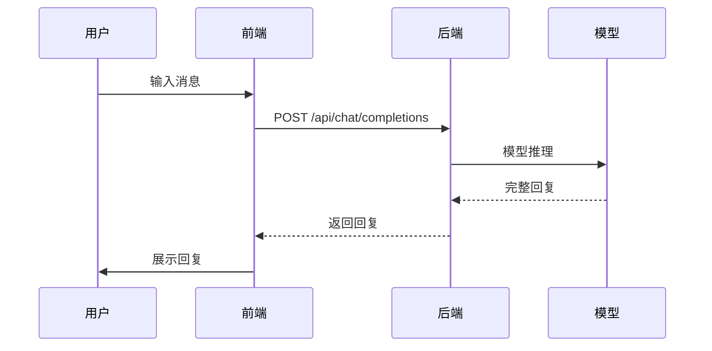
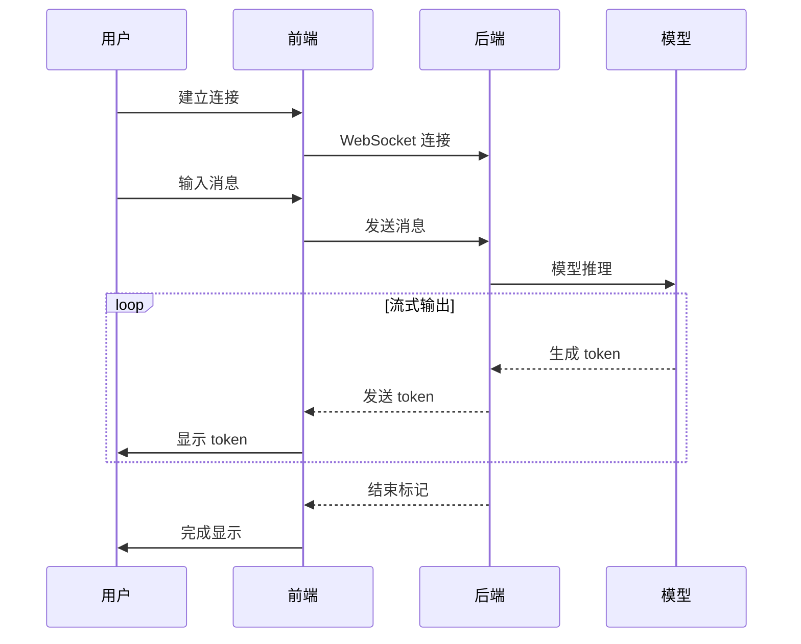

# StellarChat 设计文档

## 1. 概述

StellarChat 是一个基于大型语言模型（LLM）的实时聊天应用，旨在为用户提供流畅、智能的对话体验。本设计文档详细描述了系统的架构设计、技术选型、核心模块设计以及非功能性需求等方面的内容。

## 2. 系统架构设计

### 2.1 整体架构

StellarChat 采用前后端分离的架构模式：

```
┌─────────────────┐    HTTP/WebSocket    ┌─────────────────┐
│   前端 (React)   │◄────────────────────►│   后端 (FastAPI) │
└─────────────────┘                      └─────────────────┘
                                                     │
                                                     ▼
                                            ┌─────────────────┐
                                            │   LLM 模型服务   │
                                            └─────────────────┘
```

### 2.2 技术栈

- **前端**: React 18 + TypeScript + Vite + Tailwind CSS
- **后端**: FastAPI + Python 3.8+ + Transformers + PyTorch
- **部署**: Docker + Docker Compose

### 2.3 架构分层

1. **表现层** (前端)
   - 用户界面展示
   - 用户交互处理
   - WebSocket 连接管理

2. **应用层** (后端)
   - API 接口提供
   - 业务逻辑处理
   - WebSocket 消息处理

3. **模型层** (LLM)
   - 模型加载与管理
   - 文本分词与预处理
   - 推理计算与结果生成

## 3. 核心模块设计

### 3.1 后端核心模块

#### 3.1.1 模型推理模块 (models/inference.py)

- **单例模式**: 确保模型只加载一次，避免重复加载消耗资源
- **模型加载**: 支持自动设备映射（CPU/GPU）和精度选择（FP32/FP16）
- **推理接口**:
  - `chat()`: 同步一次性生成完整回复
  - `stream_chat()`: 异步流式生成，逐 token 输出

#### 3.1.2 分词器模块 (models/tokenizer.py)

- 使用 HuggingFace Transformers 的 AutoTokenizer
- 自动处理填充 token 缺失问题
- 提供文本编码和解码功能

#### 3.1.3 路由模块

- **chat_completions.py**: 提供 HTTP POST 接口 `/api/chat/completions` 进行聊天，兼容 OpenAI API 格式
- **chat_ws.py**: 提供 WebSocket 接口 `/api/ws/chat` 进行实时聊天
- **health.py**: 提供健康检查接口 `/api/health`
- **models.py**: 提供模型列表接口 `/api/models`

#### 3.1.4 配置管理 (config.py)

- 集中管理项目配置
- 支持环境变量覆盖默认配置
- 包含模型路径、服务端口等关键配置

#### 3.1.5 监控与日志

- 集成 Prometheus 监控指标
- 统一异常处理机制
- 结构化日志记录

### 3.2 前端核心模块

#### 3.2.1 组件设计

- **聊天窗口**: 展示对话历史和新消息
- **输入框**: 文本输入和发送控制
- **消息气泡**: 区分用户消息和 AI 回复
- **侧边栏**: 会话历史和设置选项

#### 3.2.2 状态管理

- 使用 React Hooks 管理组件状态
- WebSocket 连接状态管理
- 聊天记录状态管理

#### 3.2.3 API 服务层

- 封装 HTTP 和 WebSocket 接口调用
- 统一错误处理
- 请求/响应拦截器

## 4. API 设计

### 4.1 HTTP API

后端提供 RESTful API 接口，兼容 OpenAI API 格式：

- **健康检查**: `GET /api/health`
- **模型列表**: `GET /api/models`
- **聊天完成**: `POST /api/chat/completions` (支持流式和非流式)
  - 支持多种参数：temperature, top_p, max_tokens, stream, stop, user
  - 支持多模态消息格式
- **监控指标**: `GET /metrics`

### 4.2 WebSocket API

后端提供 WebSocket 接口用于实时聊天：

- **连接地址**: `WebSocket /api/ws/chat`
- **标准化事件流**: 支持 session_start, content_block_start, content_block_delta, content_block_stop, message_delta, message_stop, error 等事件

## 5. 非功能性需求设计

### 5.1 性能设计

- **响应时间**: 流式输出首字时间 < 500ms
- **并发支持**: 支持至少 100 个并发连接
- **资源利用**: 合理使用 CPU/GPU 资源，避免资源浪费

### 5.2 可扩展性设计

- 模块化设计，便于功能扩展
- 微服务架构，支持水平扩展
- 配置驱动，便于环境适配

### 5.3 安全性设计

- CORS 跨域访问控制
- 输入验证和过滤
- 异常信息不暴露敏感内容

### 5.4 可维护性设计

- 清晰的代码结构和命名规范
- 完整的文档和注释
- 统一的日志格式和监控指标

### 5.5 可用性设计

- 健康检查机制
- 错误恢复机制
- 优雅降级策略

## 6. 部署架构设计

### 6.1 容器化部署

- 使用 Docker 容器化前后端服务
- Docker Compose 管理多容器应用
- 环境变量配置不同部署环境

### 6.2 监控与运维

- 集成 Prometheus 监控
- 结构化日志输出
- 健康检查端点

## 7. 数据流设计

### 7.1 HTTP 聊天流程



### 7.2 WebSocket 聊天流程



## 8. 未来扩展设计

### 8.1 功能扩展

- 多轮对话上下文管理
- 对话历史持久化
- 多语言支持
- 插件系统

### 8.2 性能优化

- 模型量化和压缩
- 缓存机制优化
- 异步任务处理

### 8.3 架构演进

- 微服务拆分
- 消息队列集成
- 分布式部署支持

本设计文档为 StellarChat 项目提供了完整的技术设计方案，后续开发将基于此文档进行实现和扩展。